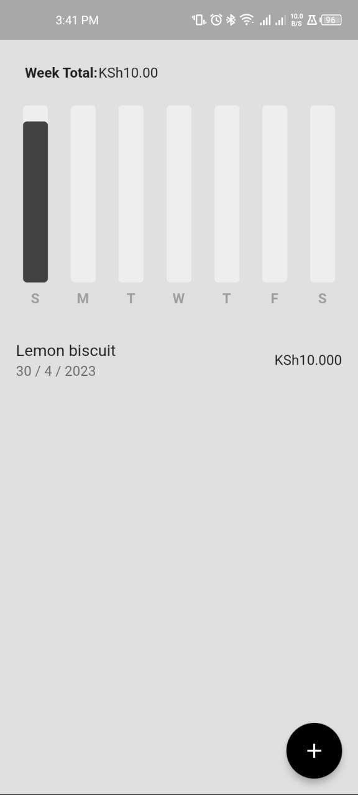

# PennyWise

This Flutter application helps users keep track of their daily expenses by allowing them to enter expenses and displaying the sum of daily expenses on a graph for each day in a week. The app also provides a weekly total of expenses to help users better manage their finances.

## Features

* Add daily expenses: Users can enter the amount and description of their expenses for each day.
* Display daily expenses: The app displays the sum of daily expenses on a graph for each day in a week.
* Weekly total: The app calculates and displays the total expenses for the entire week.

## Technologies

* Flutter: This application is built using Flutter, a mobile development framework by Google.
* Hive: Hive is used for local storage of the daily expenses entered by users.

## Getting Started

To use this application, follow these steps:

1. Clone this repository.
2. Set up Firebase Realtime Database and replace the Firebase configuration in `lib/services/firebase_service.dart` with your own.
3. Build and run the application on your device or emulator.

To install the app on your phone:

1. Download the apk from Google Drive:https://drive.google.com/file/d/1hVjymkyn9CrU7qw5q7h_ZdEOYmwB-uv3/view?usp=sharing
2. Install

## Screenshots

## Feedback and Contributions

If you have any feedback or suggestions, please feel free to open an issue or pull request on GitHub.
